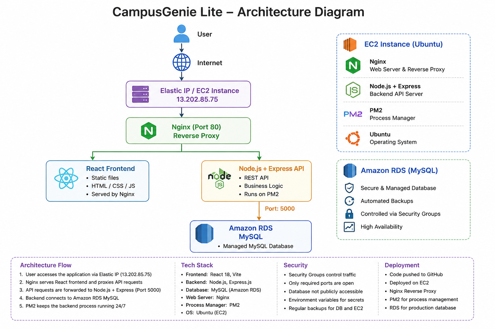

# 🎓 CampusGenie Lite

CampusGenie Lite is a full-stack student productivity application designed to bring assignments, study planning, and campus events together in a unified dashboard.

The application is deployed on AWS using Amazon EC2 for the application server and Amazon RDS MySQL for the production database.

---

## 🚀 Live Application

**Production URL:** http://13.202.85.75

---

## ✨ Features

- 📚 Assignment tracking
- 📝 Study task planning
- 🎓 Campus event management
- 📊 Student dashboard
- 🔌 REST API backend
- 🗄️ MySQL database
- 📱 Responsive frontend
- ☁️ AWS production deployment

---

## 🛠️ Tech Stack

### Frontend

- React 18
- Vite
- React DOM
- Context API

### Backend

- Node.js
- Express.js
- MySQL2
- CORS
- dotenv

### Database

- MySQL
- Amazon RDS

### Deployment

- Amazon EC2
- Ubuntu
- Nginx
- PM2
- Elastic IP
- GitHub

---

## 🏗️ Architecture


```text
                    Users
                      │
                      ▼
             Elastic IP / Public IP
                13.202.85.75
                      │
                      ▼
                 Nginx :80
                      │
          ┌───────────┴───────────┐
          │                       │
          ▼                       ▼
   React Frontend          Node.js + Express
                                  │
                                  │ :5000
                                  ▼
                         Amazon RDS MySQL
